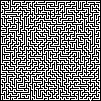
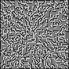

# Labyrinth Generator

A simple application to generate random labyrinths in various sizes.

## Examples

### Recursive
`labyrinth_generator -width 101 -height 101 -outmode 2`



`labyrinth_generator -width 15 -height 15`

```
########### ###
# #   #   # # #
# # # # # # # #
# # #   # # # #
# # ##### # # #
# # # #   #   #
# # # # ##### #
# #   #     # #
# ### ### ### #
# #   # #   # #
# # ### ### # #
#   #     #   #
# ### ### #####
#     #       #
## ############
```

### Growing tree

`labyrinth_generator -width 101 -height 101 -mode 2 -outmode 2`



`labyrinth_generator -width 15 -height 15 -mode 2`

```
####### #######
# #       # # #
# ####### # # #
# #   # # #   #
# ### # # ### #
#         # # #
# # ### ### # #
# # #         #
######### # ###
#         #   #
##### ### #####
# #   # #     #
# ##### # #####
#             #
######## ######
```